# Creating stories

## Creation and general options

Let's begin our foray into the creation of stories from the "Stories" screen:

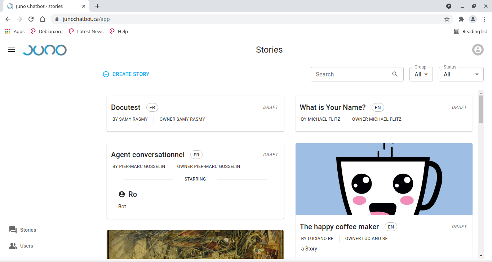

At the top you might notice a "CREATE STORY" button:

This button will only apear if you have not yet created your story. Indeed, we are limited to a single story per account for now. Once you click on it, you'll see the following dialog:

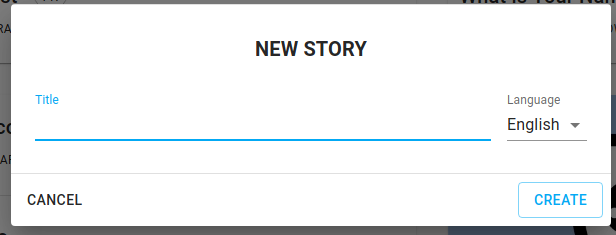

Please note that you will not be able to modify the language of the story in the future!

Once you've chosen the title and language of your story, you'll be greeted to the following screen:

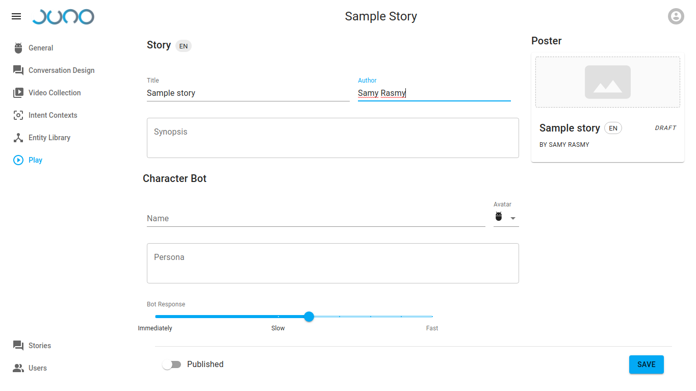

From here, you can modify the displayed name for the author, the synopsis for your story, the story name, and the persona of the bot that will converse in the story. As far as the persona, you get to change the name of the bot, choose from a few predefined avatars, write up a persona, as well as change the speed at which the bot can type.

Finally, you'll be able to chose wether or not the story should be published.

On the side, you'll be able to see what the card for your story will look like, and change the image that is associated with it.

## Conversational Design

In this section, we'll see how to design our chatbot to converse with the user. To begin, click on "Conversational Design" :

Once that's done, you will see the following screen:

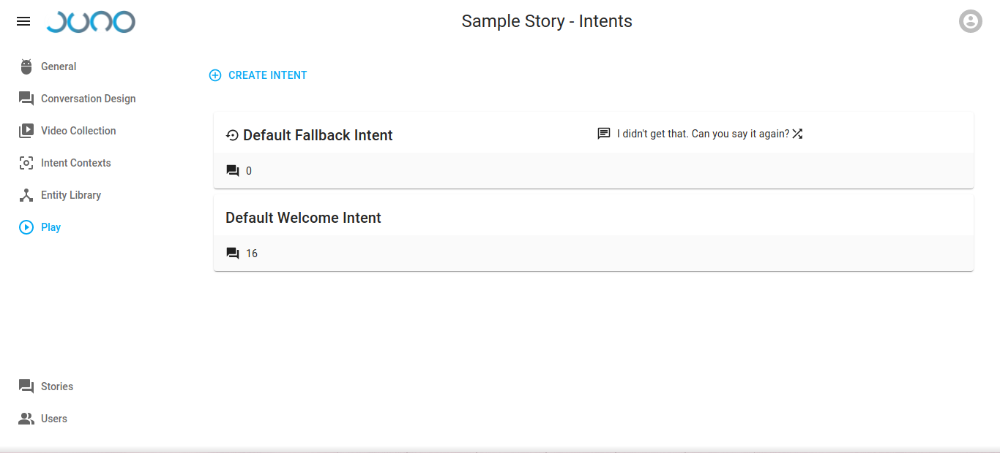

From this screen, you'll be able to set up the actual conversations the bot will attempt to have with the user.

### Intents

Chatbots work using "intents". Essentially, the chatbot works by trying to match where the intent the user has for the conversation with what amounts to a guidebook for how it should behave in such a conversation.

Indeed, you will provide the chatbot with a list of phrases that should then trigger an intent. For example, if you want your chatbot to say "Hello" back to a user, you might include phrases such as "Hi", "How are you", "hey there" and so on. When these phrases, or similar phrases are detected from the user, the chatbot will detect that intent. You can decide what the chatbot will do then.

If you look at the screen above, you'll se that there is already such an intent pre-defined for you, called "Default Welcome Intent". Let's modify it so that the chatbot says "hello" back to the user. We should start by clicking on it, and we'll then see:

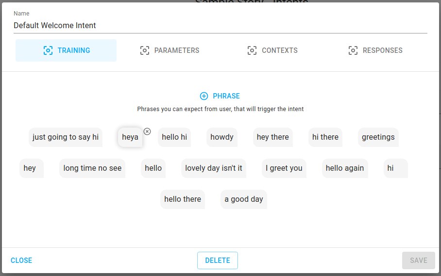

As you can see, there are already 16 training phrases. Feel free to add more. Now, let's head to the "Responses" tab to allow our chatbot to answer the user's greeting:

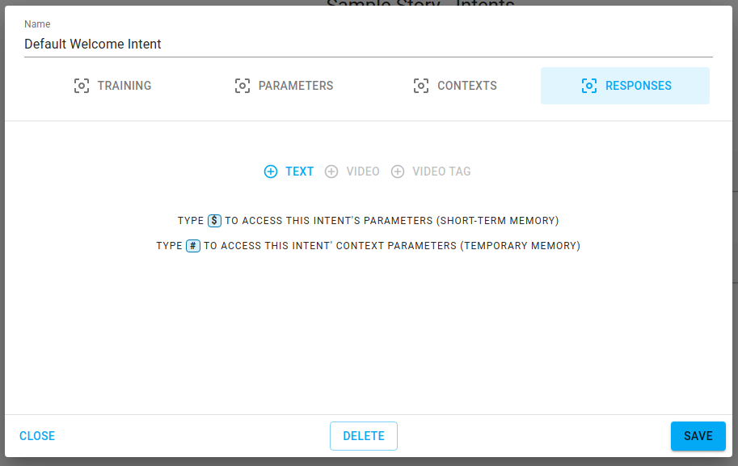

Let's add a text response to be triggered with the welcome intent by clicking this button:

We then see this form:

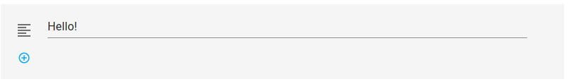

You can type whatever response you want there.

If you want to add an alternative response, so that the chatbot may reply with one of either, you can click the blue "+" icon at the bottom left.

If you want the chatbot to reply with more than one response, you can click on this button again :

And the chatbot will respond with both.

## Trying the chatbot

You can now actually try the chatbot yourself. To do so, click on the "SAVE" button on the bottom right. You will then see this entry on the side bar - click on it :

Once you do that, you'll be greeted to the chatbot interface we've seen in the former page. You'll notice that the responses you set up will be sent by the chatbot off the start. They will also be sent again if you sai "Hi" or something of the sort. This is because the Default Fallback Intent is a special intent.

## Special intents

In Juno, there are two special intents. The first of those is the Default Welcome Intent - it's not just activated when the chatbot detects something similar to the training phrase, but also at the very begninning.

There is another, arguably more important one, called the ***Default Fallback Intent***. This intent will be activated if the chatbot cannot find anything else that fits. If you add training phrases to the Default Fallback Intent, they and similar phrases will not be matched for any other intent. You should set up the fallback intent to steer the user back into conversation.

### Parameters

If you need your chatbot to remember something so that it can reply it later, you will want to use parameters. Parameters are how our chatbots will remember and recall information. For example, I might create a parameter called "person" and use it to store the name of the user.

Parameters have a value, which the chatbot can - with some help from us - find from reading the replies of the user. They also have a type - for example they may refer to people, dates, cities, and more - and we specify those in advance so the chatbot knows what to look for. We call those types "entities", which are essentially categories of things.

We'll start our journey into paramters by looking at the list of entities that are available for us. Let's look on the sidebar to explore it - click on "Entity Library" to access it :

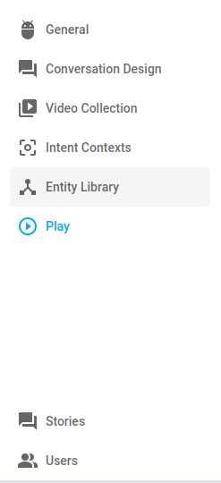

After which you'll see this page:

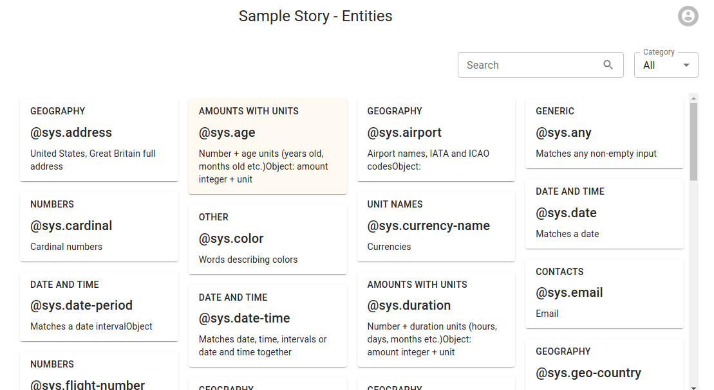

Feel free to scroll down - you can also sort by category and use the search function.

For now, let's try using parameters. Our first use for them will be to save the name of the user of the chatbot.

To do this, let's go back to the list of intents. We want the user to give us their name, so let's edit the response of the default welcome intent to ask the user their name :

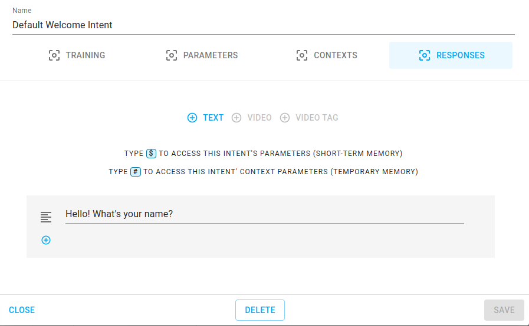

Now, we need to add an intent that will match the user describing their name. Let's call it NameIntent:

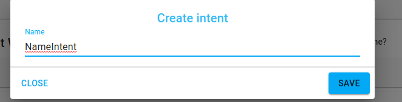

We now need to set the training phrases that will correspond to the user giving us their name:

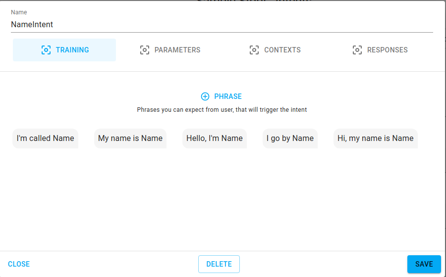

As you can see, we use "Name" as a placeholder for the name the user gives us. The issue is that the chatbot doesn't know that yet - we have to tell it. Before that though, we should click "SAVE" to make sure our intent is updated, and it's never a bad idea to close it and open it again once we make major changes. Once that's done, open the intent again and go to the "Parameters" tab:

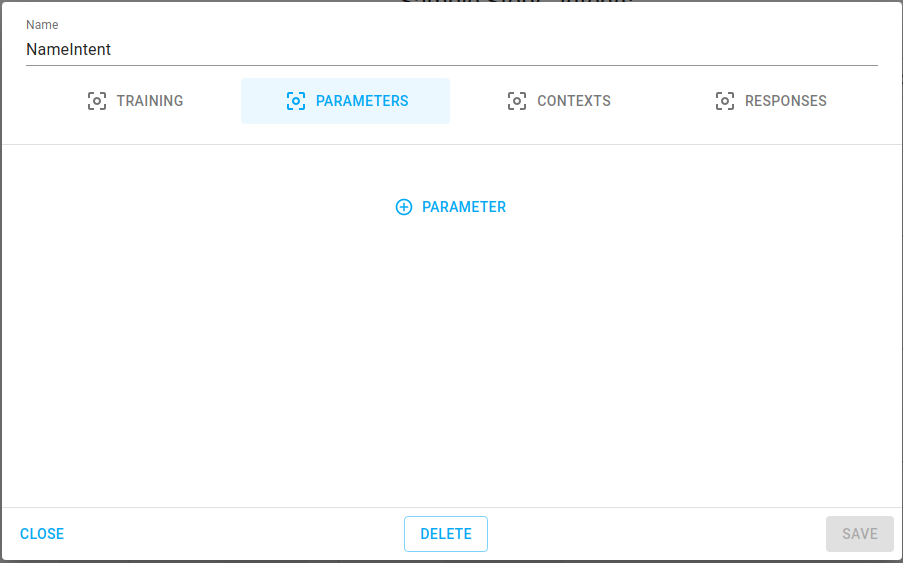

We will now click "add" and add a parameter with the name "name" and type "@sys.person" - scroll down and to see it and click on it. You should then see this:

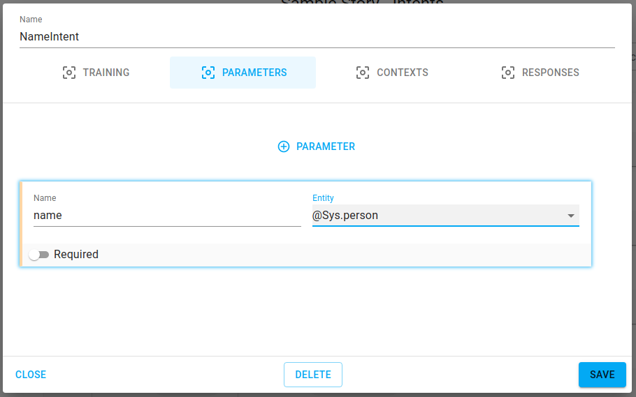

We will also make it "required". This means that if your chatbot doesn't catch it, it will make another explicit request before moving on. To do this, activate the "required" toggle and fill in the prompt :

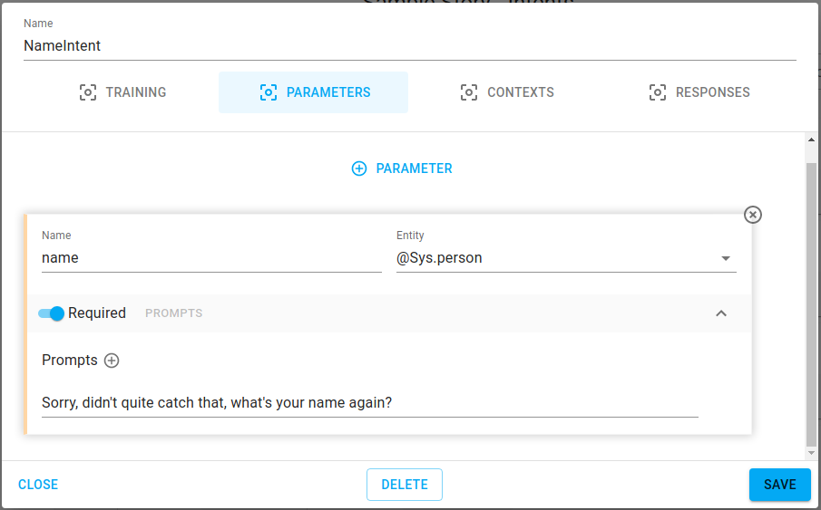

You can also experiment with multiple prompts. Once this is done, click "SAVE" and close then reopen the intent.

We will now go back to the training phrases and make it clear to our chatbot that "Name" in our phrases is a placeholder for the name parameter we just set up. To this, let's just select the placeholder in the training phrases and we'll see a drop-down appear :

We want to select "name" in this case, but it can be any other parameter we create. You can also see in a section further down in the same drop-down entity names like @sys.age - this allows you to create a parameter directly from this prompt, but I recommend against it. Once you've selected the parameter corresponding to the placeholder word, it will turn orange:

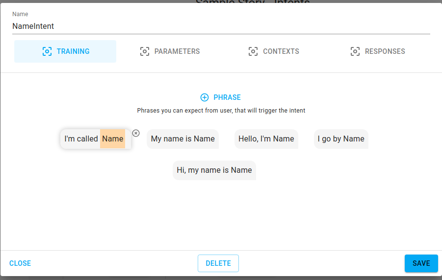

At this point, you'll want to hit "SAVE" and then do the same for all the other training phrases. You should then see something like this :

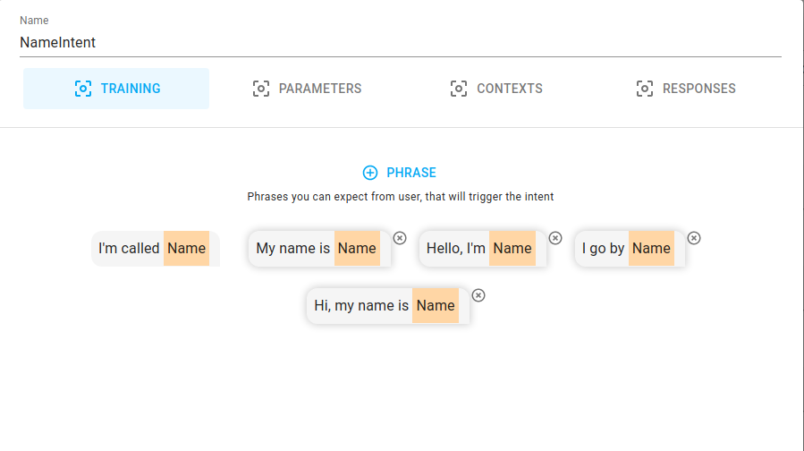

Once you see that, hit "SAVE", and you can now go on to the "Responses" tab and we'll learn how to use a parameter in replies. Let's start by writing in the following as a text response - don't copy and paste here - "Nice to meet you, $" and we will see something like this:

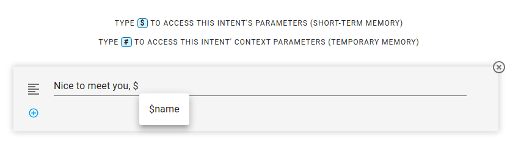

Indeed, "$" is the magic symbol to access parameters. Once you type it, you'll see a list of possibilities - the chatbot will replace $name with the parameter called "name", and so on for any other parameter. Let's select $name and save:

At this point, we can try out our chatbot by selecting "play" after closing the intent editor. Have a conversation with your own chatbot, and you will see something like this:

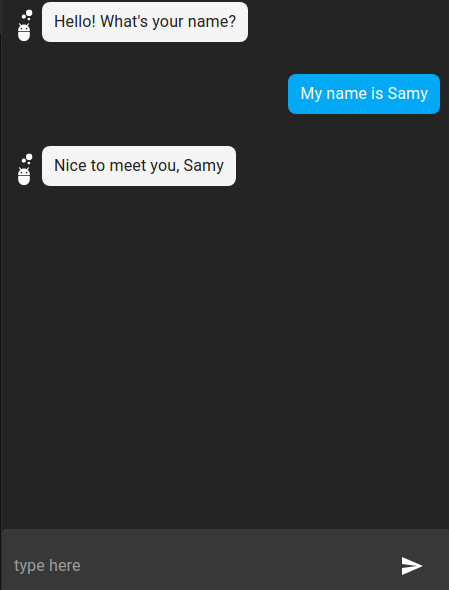

If you got it right, congrats! Otherwise, trying see where you went off-track.

## Context

Sometimes, it can be ambiguous to determine what intent to activate based solely on the last reply. In order to help with this issue, we can define "contexts", which are essentially tags that can be made active after some intent executed, and then influence which intents activate, until it expires. Let's try adding a "name-requested" context, that is activated by the default welcome intent - where we ask the user for their name. We will do so by going to the "Context" tab of the default welcome intent, which will look like this:

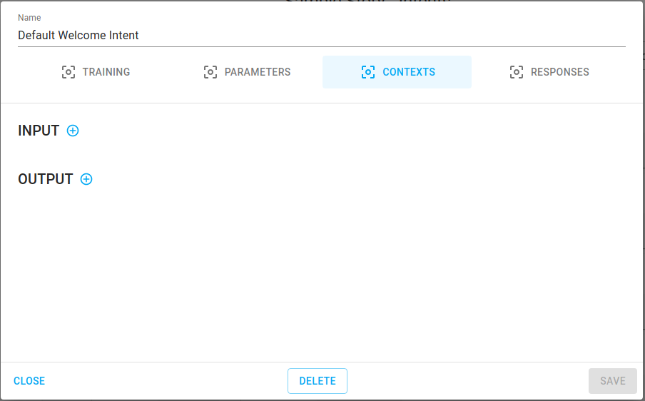

Let's add an output intent - this means that the context will be activated by this intent. We'll call it "name-requested" and set it to last two answer-reply cycles :

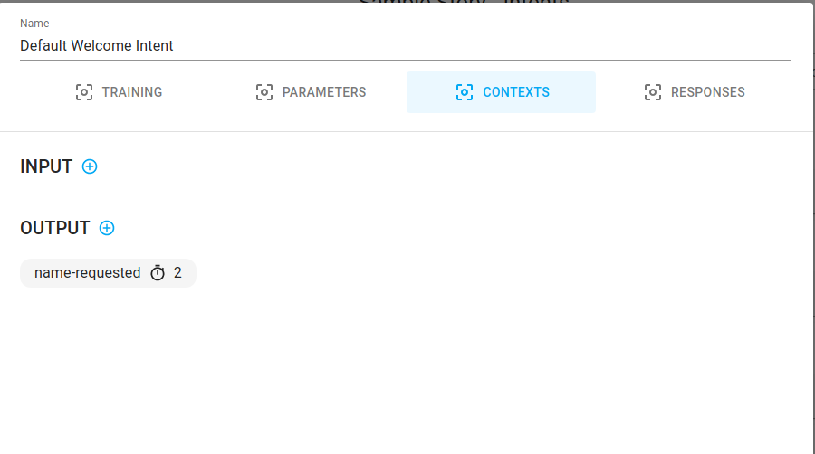

Let's now go to the "NameIntent" intent and set our input context. We have to go to the "Context" tab, and add "name-requested" as "INPUT". You will see a dropdown of available intents as you type. Once you're done, save, and it should look like this:  

If you play the story, you should now see that you can get away with answers that fit the training phrases less closely - this effect is even better when there is ambiguity between two intents. You'll also see that an output context is set automatically when you add an input context - feel free to remove it or change it's duration. This is done so that contexts remain active if they're referenced. You can add multiple output contexts and multiple input contexts to any given intent.

Note : if you have an context set as input, but that context is not active, it is impossible for the intent to be activated.

## Using parameters outside of their original context

You may have wondered how to use the information we gathered outside of the intent where it was originally found. It turns out that we can do this - if a parameter is set while some context was present, and that context is still active and set as input, we can use it in our responses. To do this, we use the following notation: `#context.parameter`. To experiment with this, let's try to allow our user to ask us to repeat back their name again. To do this, let's add a new output context to the Name Intent, with a lifetime of 100 cycles, callde `name-found`:

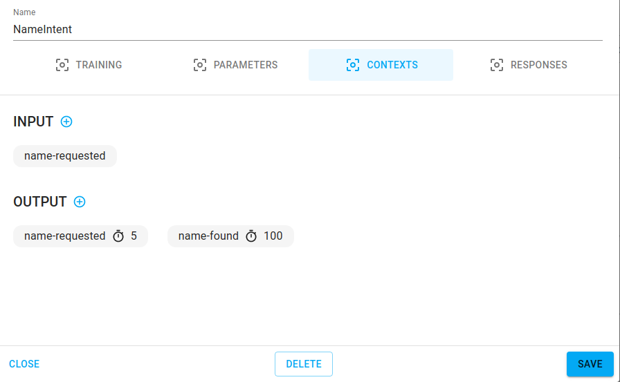

Then, let's add an intent called "NameRepeat" and give it the following training phrase:

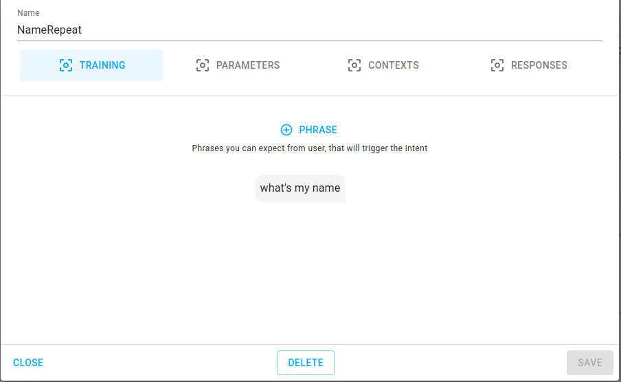

Let's now save (it never hurts to save, by the way), and then go to Contexts, and give it `name-found` as an input context. Be careful to set the duration of the output context to 100 again, because the duration and lifetime is reset :

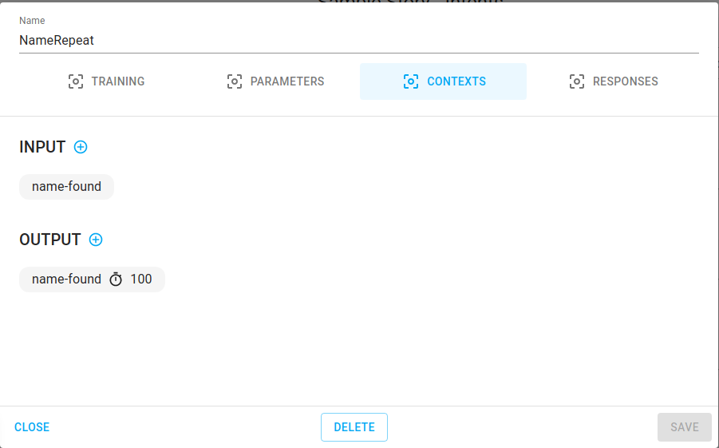

Finally, we can head to the responses, and reference the parameter found earlier as `#name-found.name` :

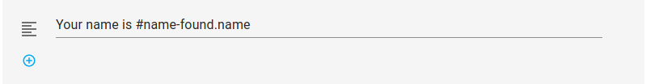

Lets try it out! Head back to Play, or reload an existing conversation, and it should go something like this:

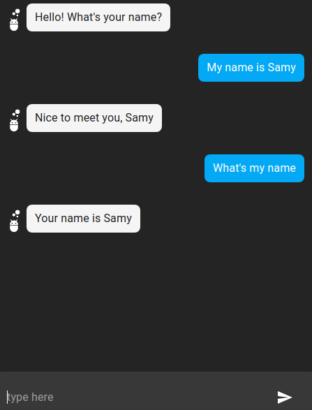

If you managed to get this done, nice job! Otherwise, you'll have to figure out where exactly this process went haywire.

## Videos

We can make our chatbots play videos whenever as they respond. To experiment with this feature, locate this highlighted section of the sidebar and click on it:

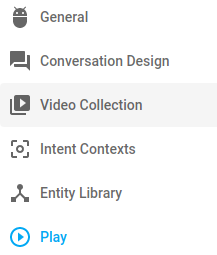

You'll then see something like this:

Let's click on "add video" at the top left, and you'll see something like this pop up:

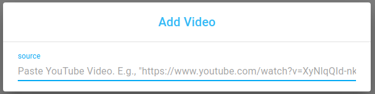

Here, you'll have to paste a youtube link. Let's try this one: <https://www.youtube.com/watch?v=DZi32bHg3qw> - paste it and hit enter.

You'll have this dialog show up, where you can add tags to organize your video and write a short description, for your organization:

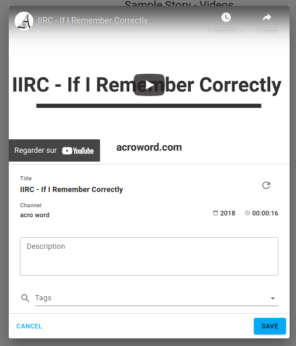

Now you can click "save", and the video will be added to your collection, and accessible by your chatbot.

Let's head into the Intent section to add the video to the response of one of our intents.

If you click on "NameRepeat", and head to the "Response" tab, you'll see the "Video" icon light up - click on it to see this dialog:

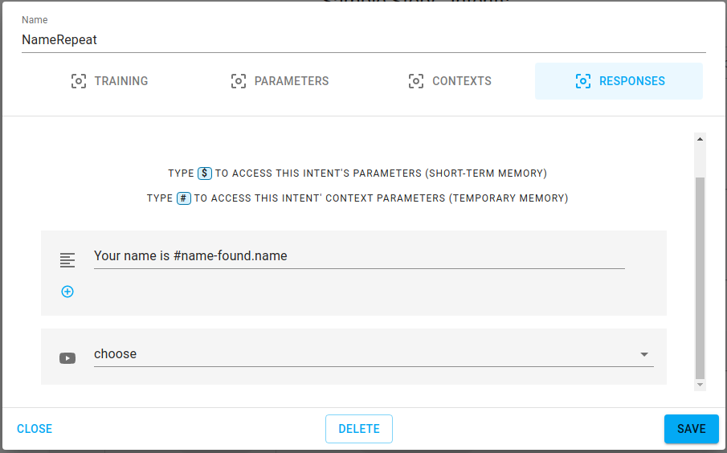

Let's choose our video, and hit save:

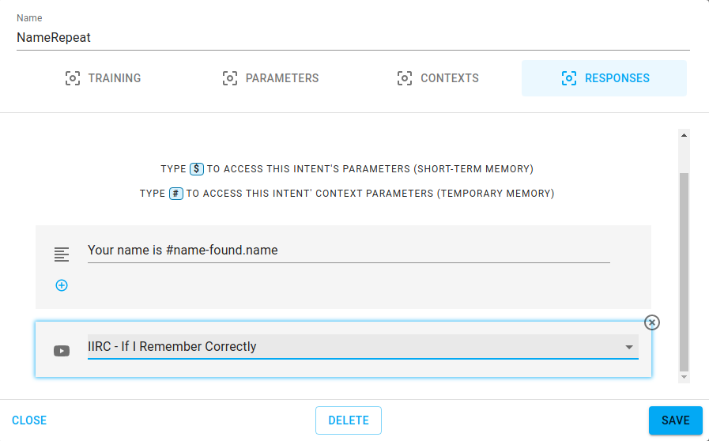

Note: you can also select a video tag, where you'll then only have the option to choose videos that have that tag from the drop-down.

We can then play our story, and when you ask for your name, you'll see the video show up:

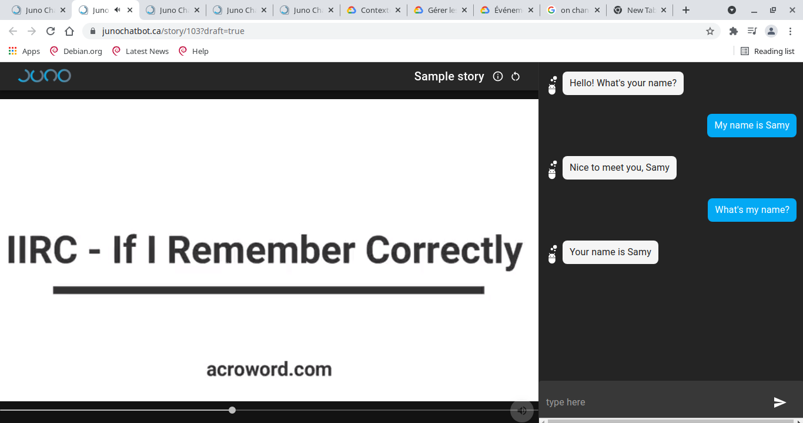

If that's what you see, congratulations! You have all the tools you need to create engaging and interactive stories. If it isn't work quite right, well, you know the drill `:)`.

Feel free to try out and explore any features you haven't seen in the module and experiment those you know - you have all the tools needed to use this tool to the fullest. That wraps it up for this tutorial!
