# Création d'histoires

## Création et options générales

Commençons notre périple dans la création d'histoires à partir de l'écran "Histoires" :

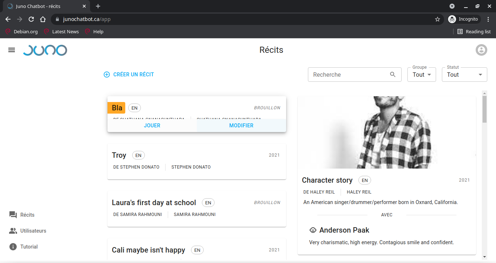

En haut, vous pouvez remarquer un bouton "CREER UN RECIT" :

Ce bouton n'apparaîtra que si vous n'avez pas encore créé votre histoire. En effet, nous sommes limités à une seule histoire par compte pour le moment. Une fois que vous aurez cliqué dessus, vous verrez apparaître le dialogue suivant :

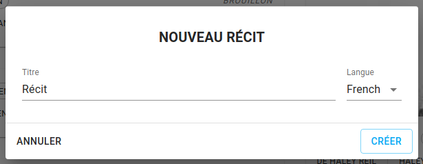

Veuillez noter que vous ne pourrez plus modifier la langue de l'histoire à l'avenir !

Une fois que vous avez choisi le titre et la langue de votre histoire, l'écran suivant s'affiche :

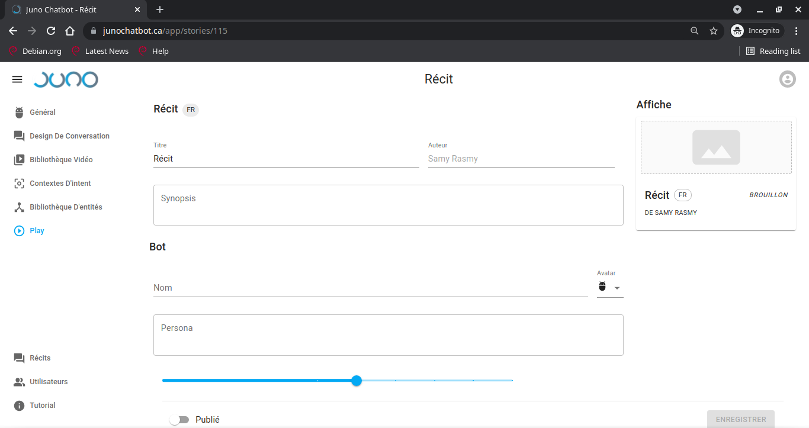

À partir de cet écran, vous pouvez modifier le nom affiché pour l'auteur, le synopsis de votre histoire, le nom de l'histoire et le personnage du robot qui conversera dans l'histoire. En ce qui concerne le personnage, vous pouvez changer le nom du robot, choisir parmi quelques avatars prédéfinis, écrire un personnage, ainsi que changer la vitesse à laquelle le robot peut taper.

Enfin, vous pourrez choisir si l'histoire doit être publiée ou non.

Sur le côté, vous pourrez voir à quoi ressemblera la carte de votre histoire et modifier l'image qui lui est associée.

## Conception conversationnelle

Dans cette section, nous allons voir comment concevoir notre chatbot pour converser avec l'utilisateur. Pour commencer, cliquez sur "Design de conversation" :
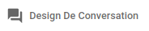

Une fois que c'est fait, vous verrez l'écran suivant :

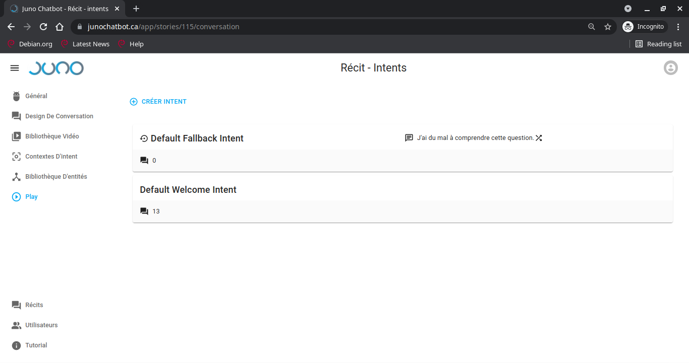

À partir de cet écran, vous pourrez configurer les conversations que le robot tentera d'avoir avec l'utilisateur.

### Intents

Les chatbots fonctionnent à l'aide d'"intents". Essentiellement, le chatbot essaie de faire correspondre l'intention de l'utilisateur pour la conversation avec ce qui équivaut à un guide sur la façon dont il doit se comporter dans une telle conversation.

En effet, vous fournirez au chatbot une liste de phrases qui devraient alors déclencher un intent. Par exemple, si vous voulez que votre chatbot renvoie " Bonjour " à un utilisateur, vous pouvez inclure des phrases telles que " Bonjour ", " Comment allez-vous ", " Bonjour ", etc. Lorsque ces phrases, ou des phrases similaires, sont détectées par l'utilisateur, le chatbot détecte cette intention. Vous pouvez alors décider de ce que le chatbot va faire.

Si vous regardez l'écran ci-dessus, vous verrez qu'il y a déjà un intent prédéfini pour vous, appelé "Default Welcome Intent". Modifions-le pour que le chatbot réponde "Bonjour! Quel est ton nom" à l'utilisateur. Nous devrions commencer par cliquer dessus, et nous verrons alors :

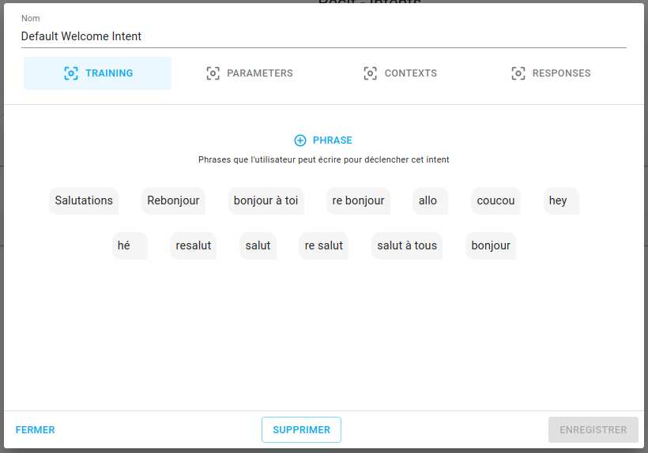

Comme vous pouvez le voir, il y a déjà 16 phrases d'entraînement. N'hésitez pas à en ajouter d'autres. Maintenant, allons dans l'onglet "Réponses" pour permettre à notre chatbot de répondre à l'accueil de l'utilisateur :

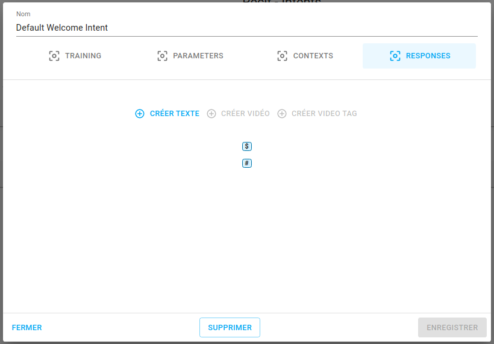

Ajoutons une réponse textuelle qui sera déclenchée avec l'intent de bienvenue en cliquant sur ce bouton :

Nous voyons alors ce formulaire :

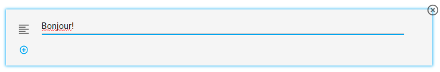

Vous pouvez y taper la réponse que vous souhaitez.

Si vous voulez ajouter une réponse alternative, afin que le chatbot puisse répondre avec l'une ou l'autre, vous pouvez cliquer sur l'icône bleue "+" en bas à gauche.

Si vous voulez que le chatbot réponde avec plus d'une réponse, vous pouvez cliquer à nouveau sur ce bouton :

Et le chatbot répondra avec les deux.

## Essayer le chatbot

Vous pouvez maintenant essayer le chatbot vous-même. Pour ce faire, cliquez sur le bouton "ENREGISTRER" en bas à droite. Vous verrez alors cette entrée sur la barre latérale - cliquez dessus :

Une fois que vous aurez fait cela, vous serez accueilli par l'interface du chatbot que nous avons vu dans la page précédente. Vous remarquerez que les réponses que vous avez configurées seront envoyées par le chatbot dès le début. Elles seront également envoyées à nouveau si vous dites "Salut" ou quelque chose de ce genre. Cela est dû au fait que le Default Welcome Intent est un intent spécial.

## Intents spéciaux

Dans Juno, il existe deux Intents spéciaux. Le premièr est l'intent de bienvenue par défaut - il n'est pas seulement activé lorsque le chatbot détecte quelque chose de similaire à la phrase d'entraînement, mais aussi au tout début.

Il en existe un autre, sans doute plus important, appelé ***Default Fallback Intent***. Cette intent sera déclenché si le chatbot ne trouve rien d'autre qui corresponde. Si vous ajoutez des phrases d'entraînement au Default Fallback Intent, ces phrases, ainsi que d'autres phrases similaires, ne correspondront à aucune autre intention. Vous devriez le configurer pour ramener l'utilisateur dans la conversation.

### Paramètres

Si vous voulez que votre chatbot se souvienne de quelque chose pour pouvoir y répondre plus tard, vous devez utiliser des paramètres. Les paramètres permettent à nos chatbots de se souvenir et de rappeler des informations. Par exemple, on peut créer un paramètre appelé "personne" et l'utiliser pour stocker le nom de l'utilisateur.

Les paramètres ont une valeur, que le chatbot peut - avec notre aide - trouver en lisant les réponses de l'utilisateur. Ils ont également un type - par exemple, ils peuvent faire référence à des personnes, des dates, des villes, etc. - et nous les spécifions à l'avance pour que le chatbot sache ce qu'il doit rechercher. Nous appelons ces types "entités", qui sont essentiellement des catégories de choses.

Nous allons commencer notre voyage dans les paramètres en examinant la liste des entités qui sont à notre disposition. Regardons dans la barre latérale pour l'explorer - cliquez sur "Entity Library" pour y accéder :

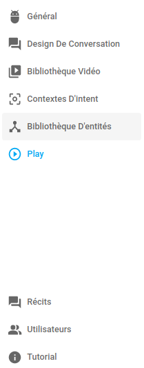

Après quoi vous verrez cette page :

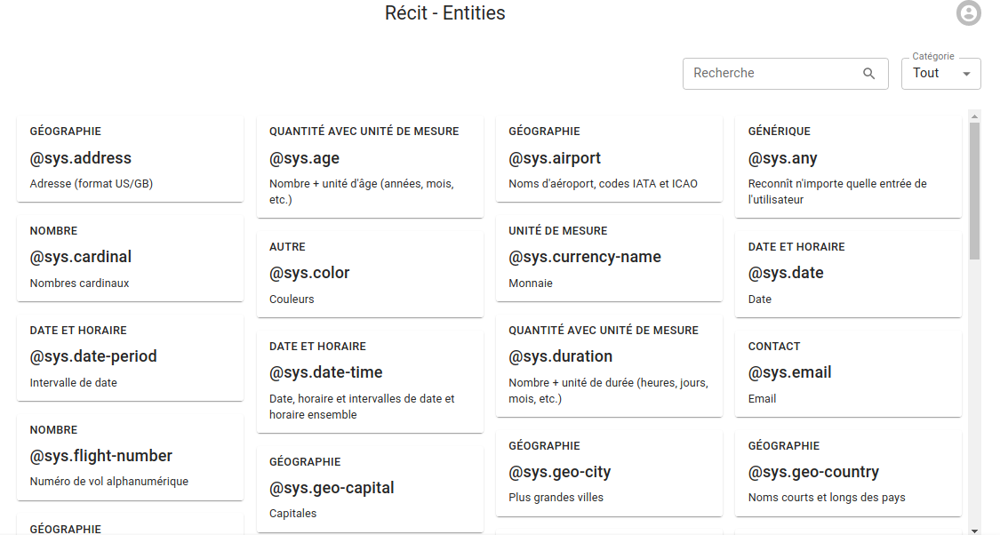

N'hésitez pas à faire défiler la page - vous pouvez également la trier par catégorie et utiliser la fonction de recherche.

Pour l'instant, essayons d'utiliser des paramètres. La première utilisation que nous en ferons sera d'enregistrer le nom de l'utilisateur du chatbot.

Pour ce faire, revenons à la liste des intentions. Nous voulons que l'utilisateur nous donne son nom, alors modifions la réponse de l'intention de bienvenue par défaut pour demander à l'utilisateur son nom :

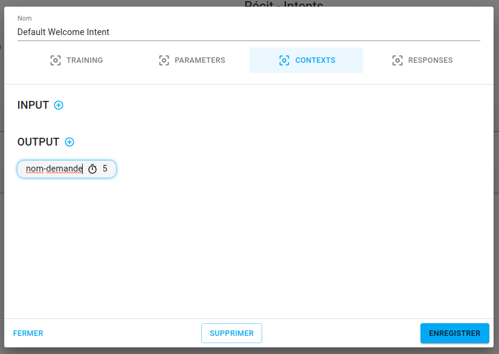

Maintenant, nous devons ajouter un intent qui correspondra à la description du nom de l'utilisateur. Appelons-le NameIntent :

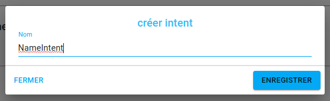

Nous devons maintenant définir les phrases d'entraînement qui correspondront à l'utilisateur qui nous donne son nom :

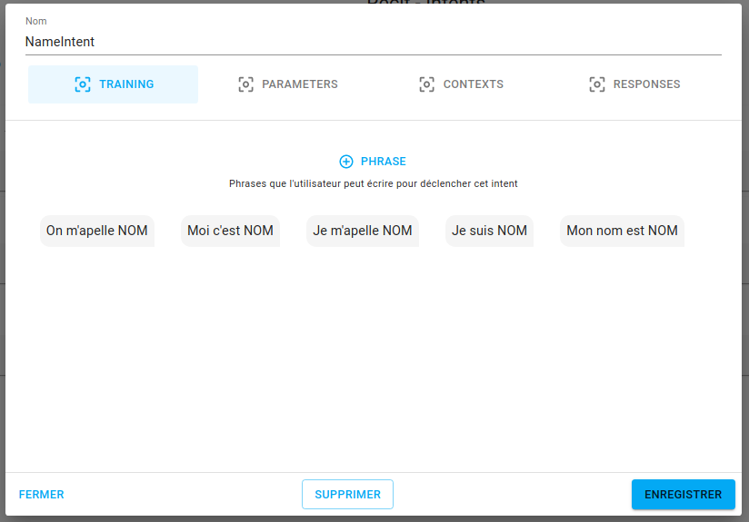

Comme vous pouvez le voir, nous utilisons " NOM " comme substitut du nom que l'utilisateur nous donne. Le problème est que le chatbot ne le sait pas encore - nous devons le lui dire. Avant cela, nous devrions cliquer sur " ENREGISTRER " pour nous assurer que notre intent est bien actualisé, et ce n'est jamais une mauvaise idée de le fermer et de le rouvrir lorsque nous apportons des modifications importantes. Une fois que c'est fait, ouvrez à nouveau l'intent et allez dans l'onglet "Paramètres" :

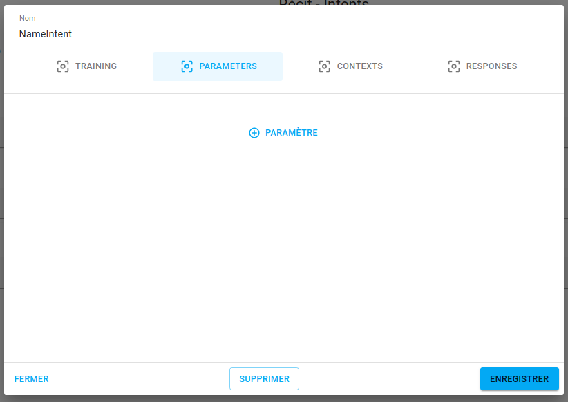

Nous allons maintenant cliquer sur " ajouter " et ajouter un paramètre avec le nom " nom " et le type " @sys.person " - faites défiler vers le bas et pour le voir et cliquez dessus. Vous devriez alors voir ceci :

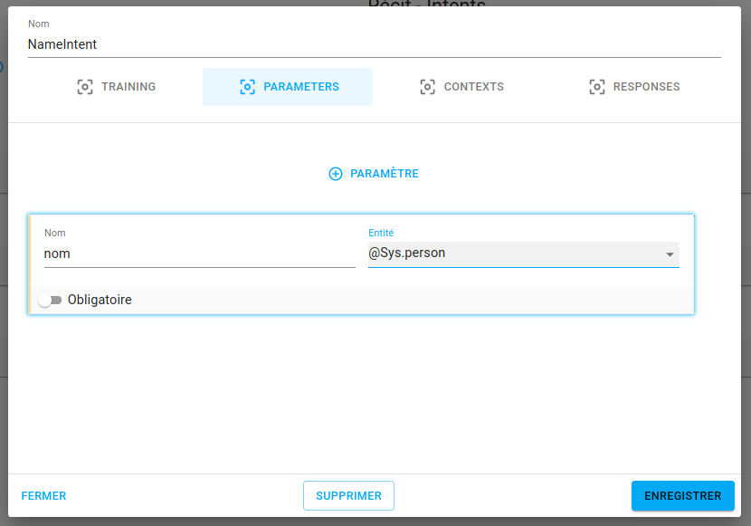

Nous allons également le rendre "obligatoire". Cela signifie que si votre chatbot ne l'attrape pas, il fera une autre demande explicite avant de passer à autre chose. Pour ce faire, activez l'interrupteur " obligatoire " et remplissez l'invite :

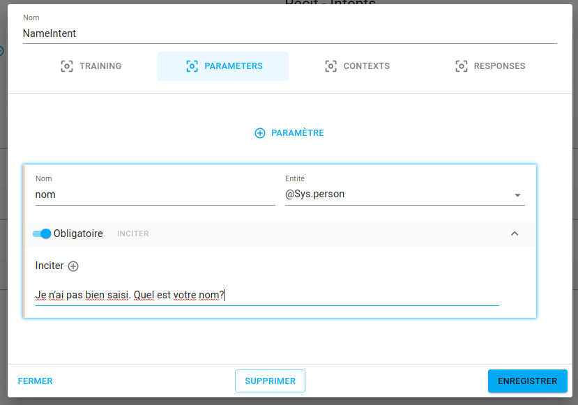

Vous pouvez également expérimenter avec plusieurs invites. Une fois que c'est fait, cliquez sur " ENREGISTRER " et fermez puis rouvrez l'intent.

Nous allons maintenant revenir aux phrases de formation et faire comprendre à notre chatbot que "NOM" dans nos phrases est un espace réservé pour le paramètre de nom que nous venons de configurer. Pour cela, il suffit de sélectionner le caractère générique dans les phrases de formation et nous verrons apparaître une liste déroulante :

Nous voulons sélectionner "name" dans ce cas, mais il peut s'agir de n'importe quel autre paramètre que nous créons. Vous pouvez également voir dans une section plus bas dans la même liste déroulante des noms d'entités comme @sys.age - cela vous permet de créer un paramètre directement à partir de cette invite, mais je vous le déconseille. Une fois que vous avez sélectionné le paramètre correspondant au mot générique, celui-ci devient orange :

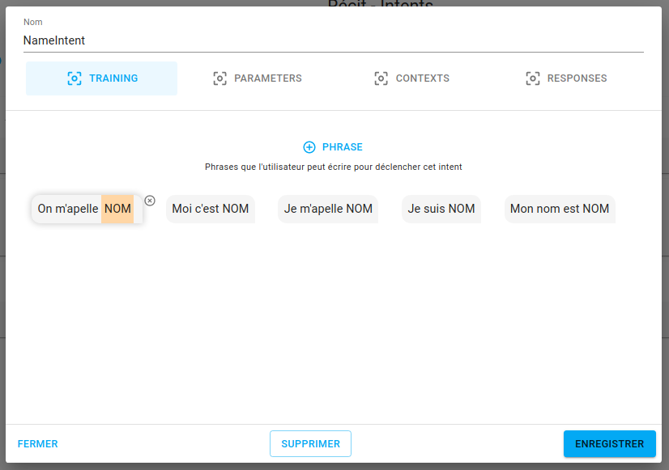

À ce stade, vous voudrez appuyer sur " ENREGISTRER ", puis faire de même pour toutes les autres phrases d'entraînement. Vous devriez alors voir quelque chose comme ceci :

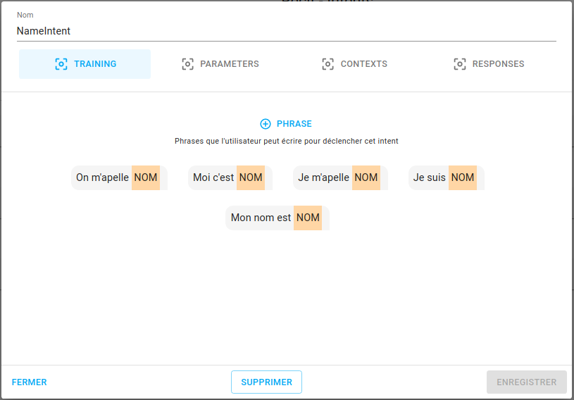

Une fois que vous voyez cela, appuyez sur "ENREGISTRER", et vous pouvez maintenant passer à l'onglet "Responses" et nous allons apprendre à utiliser un paramètre dans les réponses. Commençons par écrire ce qui suit en tant que réponse textuelle - ne faites pas de copier-coller ici - "Enchanté, $" et nous verrons quelque chose comme ceci :

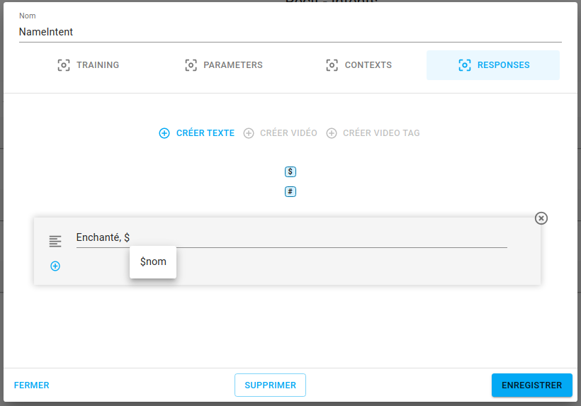

En effet, "$" est le symbole magique pour accéder aux paramètres. Une fois que vous l'aurez tapé, vous verrez une liste de possibilités - le chatbot remplacera $name par le paramètre appelé "name", et ainsi de suite pour tout autre paramètre. Sélectionnons $name et enregistrons :

À ce stade, nous pouvons essayer notre chatbot en sélectionnant "play" après avoir fermé l'éditeur d'intentions. Engagez une conversation avec votre propre chatbot, et vous verrez quelque chose comme ceci :

Si vous avez bien compris, félicitations ! Sinon, essayez de voir où vous avez fait fausse route.

## Contexte

Parfois, il peut être ambigu de déterminer l'intent à activer en se basant uniquement sur la dernière réponse. Afin d'aider à résoudre ce problème, nous pouvons définir des "contextes", qui sont essentiellement des balises qui peuvent être rendues actives après l'exécution d'une certaine intention, et qui influencent ensuite les intentions à activer, jusqu'à ce qu'elles expirent. Essayons d'ajouter un contexte "demande de nom", qui est activé par l'intention de bienvenue par défaut - où nous demandons à l'utilisateur son nom. Nous le ferons en allant dans l'onglet "Contexte" de l'intention de bienvenue par défaut, qui ressemblera à ceci :

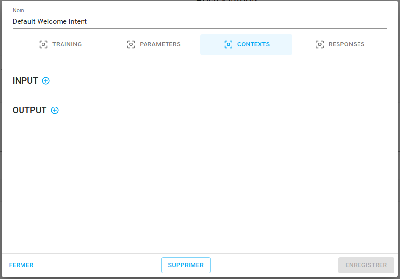

Ajoutons une intention de sortie - cela signifie que le contexte sera activé par cette intention. Nous l'appellerons "nom-demande" et la définirons sur les deux derniers cycles réponse-réponse :

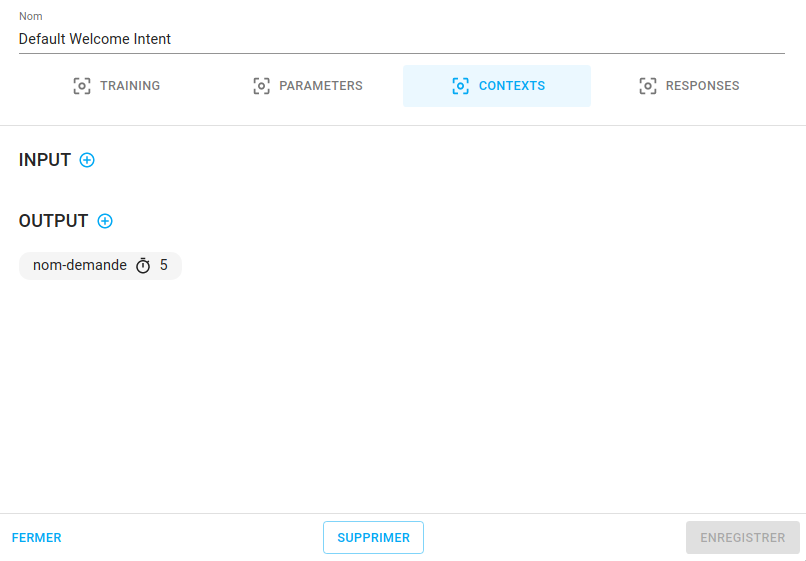

Passons maintenant à l'intent "NameIntent" et définissons notre contexte d'entrée. Nous devons aller dans l'onglet "Contexte", et ajouter "nom-demande" comme "INPUT". Vous verrez une liste déroulante des intentions disponibles lorsque vous tapez. Une fois que vous avez terminé, sauvegardez, et cela devrait ressembler à ceci :  

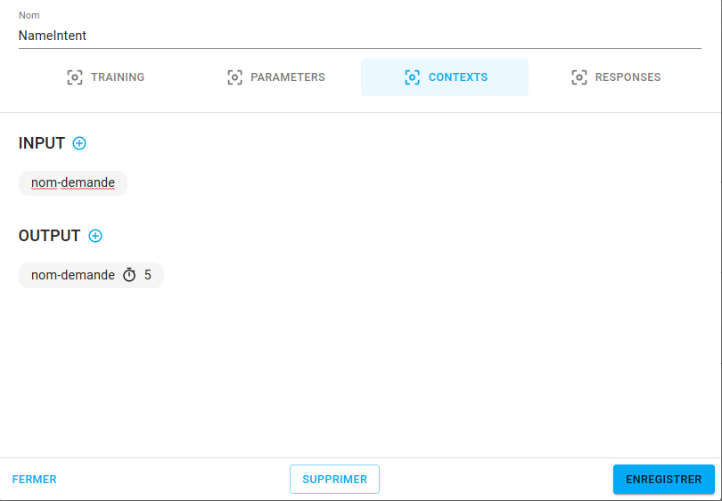

Si vous jouez le récit, vous devriez maintenant voir que vous pouvez vous en sortir avec des réponses qui correspondent plus ou moins aux phrases d'entraînement - cet effet est encore plus marqué lorsqu'il y a une ambiguïté entre deux intentions. Vous verrez également qu'un contexte de sortie est automatiquement défini lorsque vous ajoutez un contexte d'entrée - n'hésitez pas à le supprimer ou à modifier sa durée. Ceci est fait pour que les contextes restent actifs s'ils sont référencés. Vous pouvez ajouter plusieurs contextes de sortie et plusieurs contextes d'entrée à une intention donnée.

Remarque : si vous avez un contexte défini comme entrée, mais que ce contexte n'est pas actif, il est impossible que l'intent soit lancé.

## Utilisation de paramètres en dehors de leur contexte d'origine

Vous vous êtes peut-être demandé comment utiliser les informations que nous avons recueillies en dehors de l'intent où elles ont été trouvées à l'origine. Il s'avère que c'est possible : si un paramètre est défini alors qu'un certain contexte était présent, et que ce contexte est toujours actif et défini comme entrée, nous pouvons l'utiliser dans nos réponses. Pour ce faire, nous utilisons la notation suivante : `#context.parameter`. Pour expérimenter cela, essayons de permettre à notre utilisateur de nous demander de répéter son nom à nouveau. Pour ce faire, ajoutons un nouveau contexte de sortie au Name Intent, avec une durée de vie de 100 cycles, appelé `nom-trouve` :

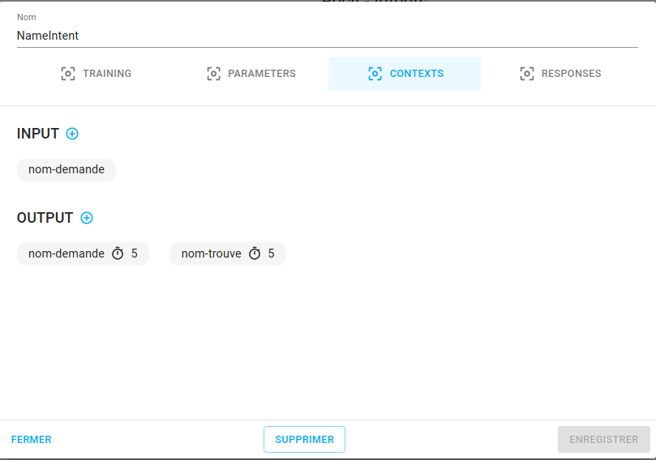

Ensuite, ajoutons une intention appelée "NameRepeat" et donnons-lui la phrase d'entraînement suivante :

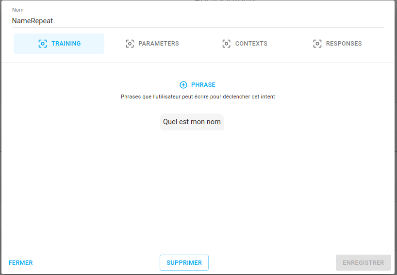

Sauvegardons maintenant ( cela ne fait jamais de mal de sauvegarder, d'ailleurs), puis allons dans Contextes, et donnons-lui `nom-trouve` comme contexte d'entrée. Faites attention à remettre la durée du contexte de sortie à 100, parce que la durée et l'âge sont remis à zéro :

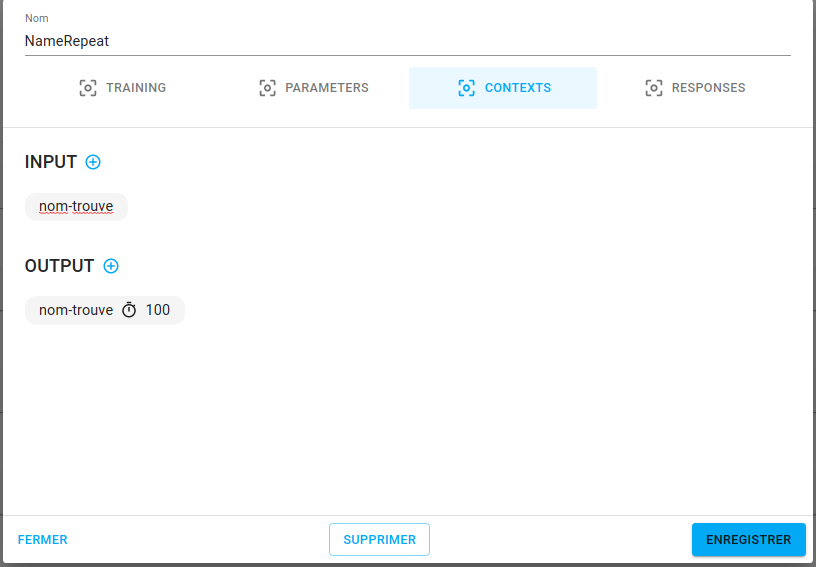

Enfin, nous pouvons nous diriger vers les réponses, et référencer le paramètre trouvé plus tôt comme `#name-found.name` :

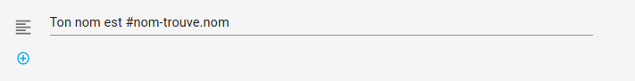

Essayons-le ! Retournez à Play, ou rechargez une conversation existante, et ça devrait ressembler à ça :

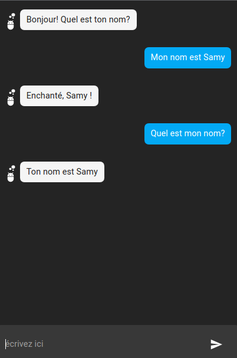

Si vous avez réussi à faire ça, bravo ! Dans le cas contraire, vous devrez trouver où ce processus s'est détraqué.

## Vidéos

Nous pouvons faire en sorte que nos chatbots lisent des vidéos lorsqu'ils répondent. Pour expérimenter cette fonctionnalité, localisez cette section en surbrillance de la barre latérale et cliquez dessus :

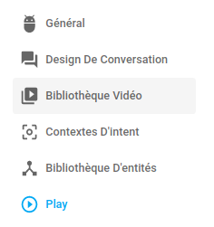

Vous verrez alors quelque chose comme ceci :

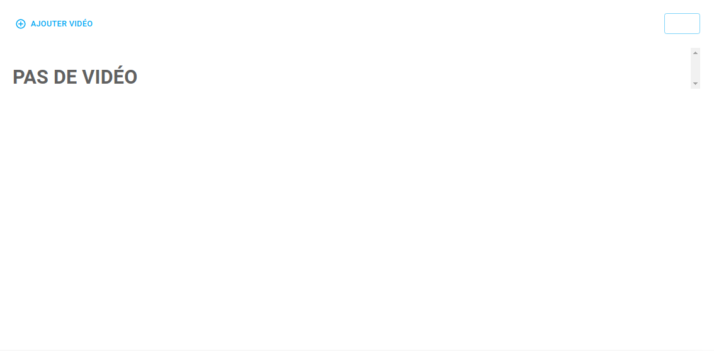

Cliquez sur "Ajouter une vidéo" en haut à gauche, et vous verrez apparaître quelque chose comme ceci :

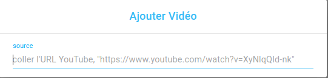

Ici, vous devrez coller un lien youtube. Essayons celui-ci : <https://www.youtube.com/watch?v=DZi32bHg3qw> - collez-le et appuyez sur la touche Entrée.

Cette boîte de dialogue s'affichera, où vous pourrez ajouter des balises pour organiser votre vidéo et écrire une courte description, pour votre organisation :

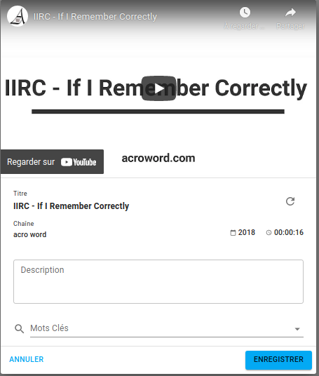

Vous pouvez maintenant cliquer sur "Enregistrer", et la vidéo sera ajoutée à votre collection, et accessible par votre chatbot.

Allons dans la section Intent pour ajouter la vidéo à la réponse de l'un de nos intents.

Si vous cliquez sur "NameRepeat", et allez dans l'onglet "Response", vous verrez l'icône "Video" s'allumer - cliquez dessus pour voir cette boîte de dialogue :

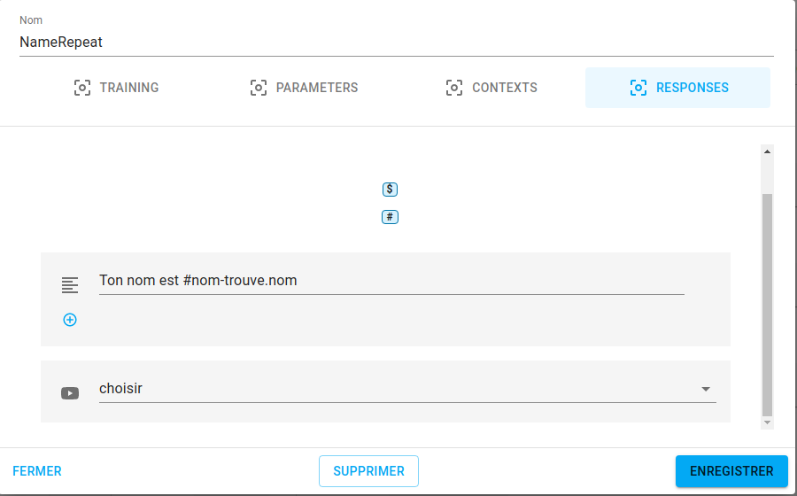

Choisissons notre vidéo, et cliquons sur enregistrer :

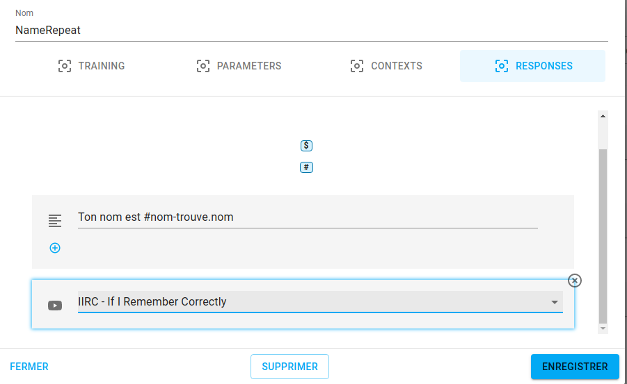

Remarque : vous pouvez également sélectionner une balise vidéo, ce qui vous permettra de ne choisir que les vidéos ayant cette balise dans la liste déroulante.

Nous pouvons alors jouer notre histoire, et lorsque vous demanderez votre nom, vous verrez la vidéo s'afficher :

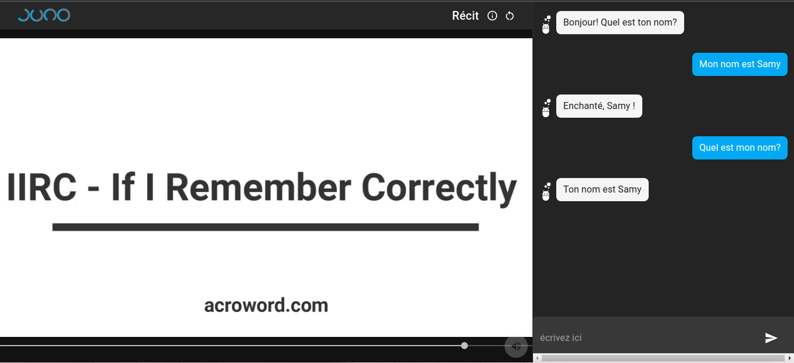

Si c'est ce que vous voyez, félicitations ! Vous avez tous les outils nécessaires pour créer des histoires engageantes et interactives. Si cela ne fonctionne pas tout à fait correctement, eh bien, vous connaissez la chanson `:)`.

N'hésitez pas à essayer et à explorer toutes les fonctionnalités que vous n'avez pas vues dans le module et à expérimenter celles que vous connaissez - vous avez tous les outils nécessaires pour utiliser cet outil au maximum. C'est tout pour ce tutoriel !
