# Introduction to Juno

Welcome to Juno! In this tutorial, you will learn the very basics of how to use Juno.
This will allow you to create your own stories. So let's get started with the main screen!

## Main Screen

This is what the main screen looks like:

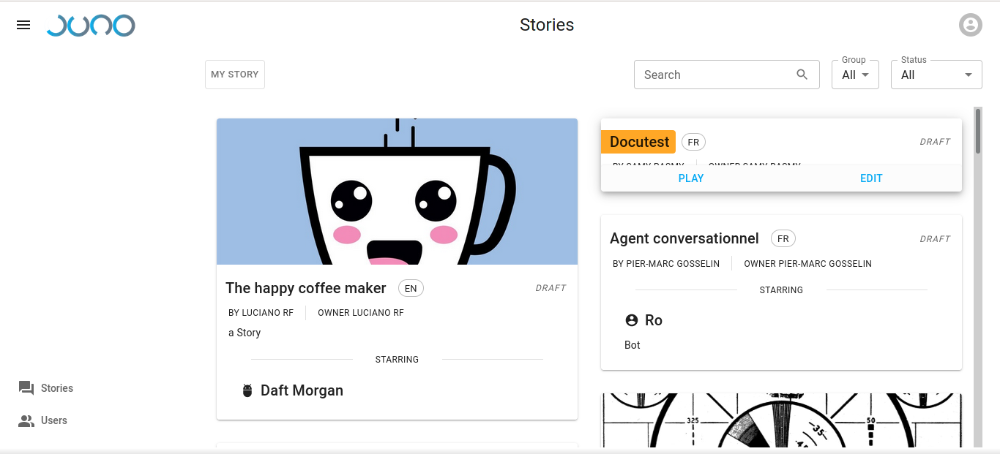

As you can see the main screen contains a list of stories, as well as a menu on the left side. Let's start with the list of stories.

## Story list

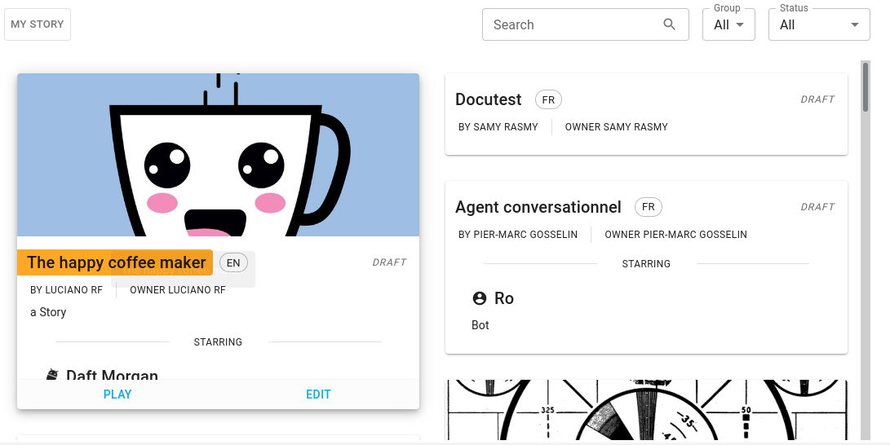

Here you can see a list of all stories that are accessible to you. You can search for a story
using the search bar:

You may, or may not, depending on your permissions, also be able to sort by the group to which
the story's author belongs, as well as by the status of the story (published or draft).

Draft stories are not normally visible, it's the designation for stories that are not yet ready
for prime time and that the author elected to hide in the mean time.

You can also click the "MY STORY" button which will focus on your very own story, when there is one. If you don't have a story yet, this will be replaced by an "ADD STORY" button that will allow you to create one. More on that later.

## Playing a story

If you mouseover a story, you'll be able to play it. If you're the author of the story, you'll also see the option to edit it.

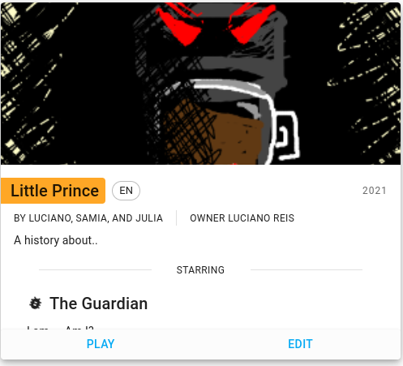

Once you click on "PLAY", you will see the chatbot interface. This is how people can interact with our interactive stories.

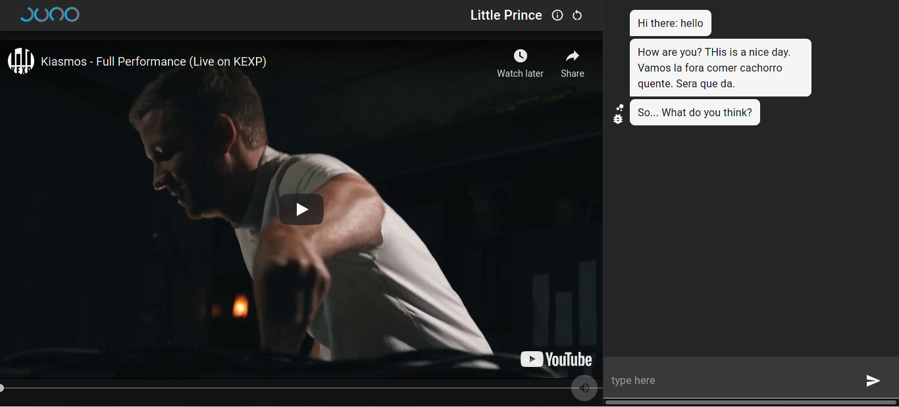

If you look on the right, you'll see a classic messaging interface. On the bottom is the entry field, where you'll be able to send messages. The chatbot will reply to you:

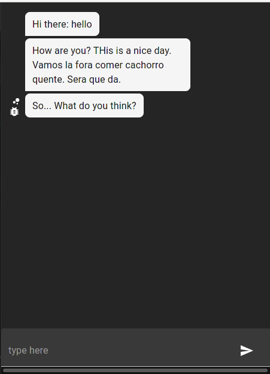

On the right side is the multimedia interface. This is the place where videos and other media will be displayed:

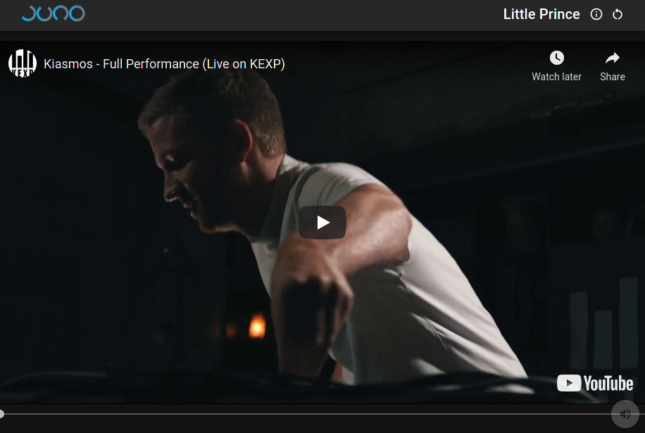

If you look to the top, you can see the name of the story currently played, as well as an "i" button, and a refresh button:

The "i" button, when clicked, reveals the description of the story. The refresh button on the other hand, allows you to reload the story if you ever do come to a dead-end.

## Side menu

If you go back to the previous tab, you will be presented with the story list. This will allow you to go back to the story list, or if available, go to the user list. This menu will also hold other items in edit mode, which we will see later.

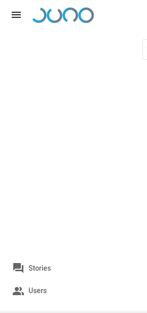

You can make this menu smaller or larger by clicking on the three lines at the very top.

## User list

By clicking on the "Users" option in the side menu mentioned above. This will bring you to the following screen:

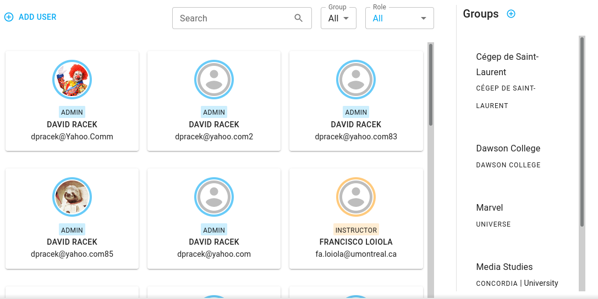

You can see a list of users, with a search function identical to the one in the story list.
On the right side, there is a list of all the existing groups.

Users fall into three categories:

- Students
- Instructors
- Admins

With a different set of permissions and accesses [#TODO]

If you have the permission, you may add a user by clicking the "ADD USER" menu. This will open the following dialog:

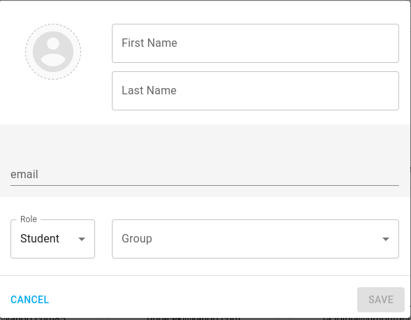

You must specify their:

- First name
- Last name
- Email address
- Role

Optionally, you may also specify their:

- Group affiliation
- Profile picture

Please note, the email address and permission level of a user may not be changed.

By clicking on a user, a similar dialog opens:

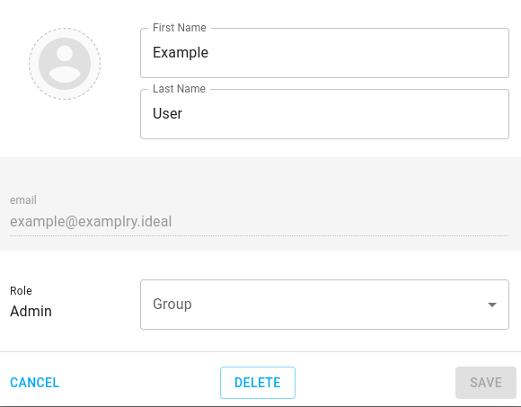

From which you can also delete a user, if you have the permission to do so.

## Settings

By clicking on your avatar at the top right of the main screen, you get the following menu:

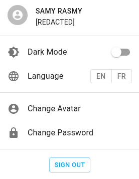

From this you can enable a dark theme, change the interface language (this does not affect the stories themselves), as well as update your profile picture and password.

This concludes our intro to Juno! Our [next chapter](www.junobot.com/tutorials/creation) touches on the creation of stories.
