# Introduction à Juno

Bienvenue à Juno ! Dans ce tutoriel, vous allez apprendre les bases de l'utilisation de Juno.
Cela vous permettra de créer vos propres histoires. Commençons par l'écran principal !

## Écran principal

Voici à quoi ressemble l'écran principal :

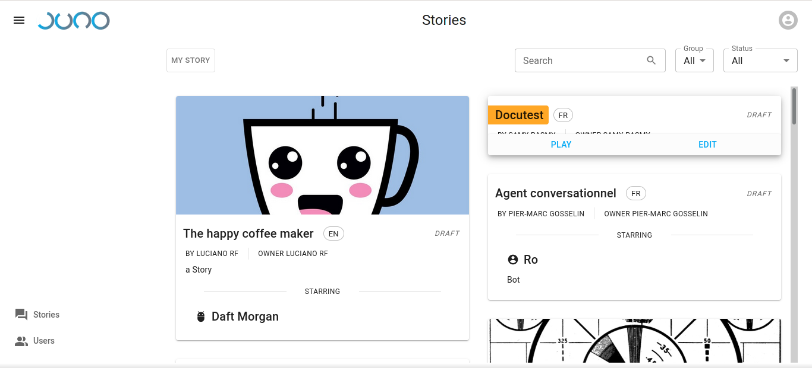.

Comme vous pouvez le voir, l'écran principal contient une liste d'histoires, ainsi qu'un menu sur le côté gauche. Commençons par la liste des histoires.

## Liste des histoires

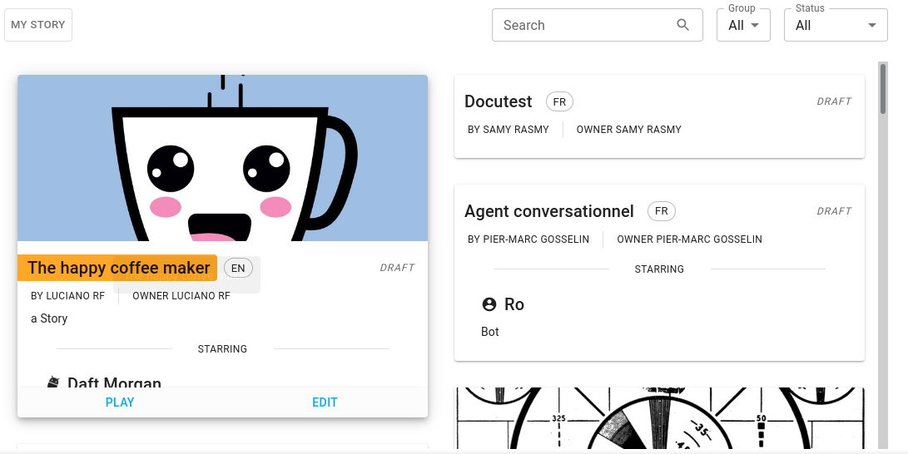

Ici, vous pouvez voir une liste de toutes les histoires qui vous sont accessibles. Vous pouvez rechercher une histoire
en utilisant la barre de recherche :

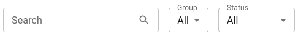.

Vous pouvez, ou non, en fonction de vos permissions, également être en mesure de trier par le groupe auquel
l'auteur de l'histoire appartient, ainsi que par le statut de l'histoire (publiée ou brouillon).

Les brouillons ne sont normalement pas visibles, c'est la désignation pour les histoires qui ne sont pas encore prêtes pour le prime time et que l'auteur a choisi de publier.
pour le prime time et que l'auteur a choisi de cacher en attendant.

Vous pouvez également cliquer sur le bouton "MON HISTOIRE", qui vous permettra d'accéder à votre propre histoire, lorsqu'il y en a une. Si vous n'avez pas encore d'histoire, ce bouton sera remplacé par un bouton "AJOUTER UNE HISTOIRE" qui vous permettra d'en créer une. Nous y reviendrons plus tard.

## Jouer une histoire

Si vous passez la souris sur une histoire, vous pourrez la lire. Si vous êtes l'auteur de l'histoire, vous verrez également l'option de la modifier.

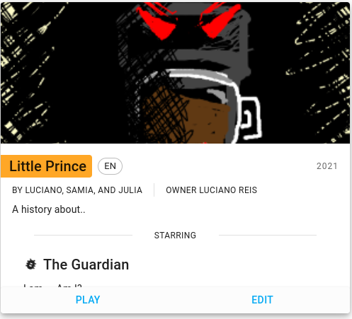

Une fois que vous aurez cliqué sur "PLAY", vous verrez l'interface du chatbot. C'est ainsi que les gens peuvent interagir avec nos histoires interactives.

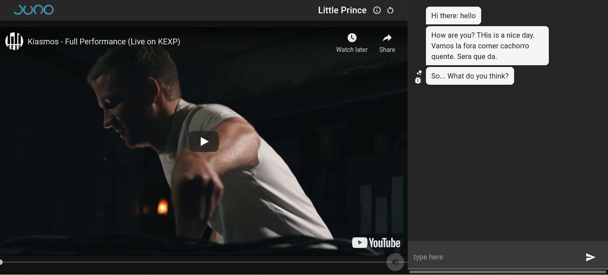

Si vous regardez à droite, vous verrez une interface de messagerie classique. En bas, il y a le champ de saisie, où vous pourrez envoyer des messages. Le chatbot vous répondra :

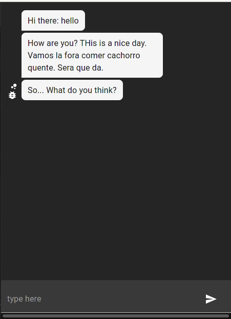

Sur le côté droit se trouve l'interface multimédia. C'est l'endroit où les vidéos et autres médias seront affichés :

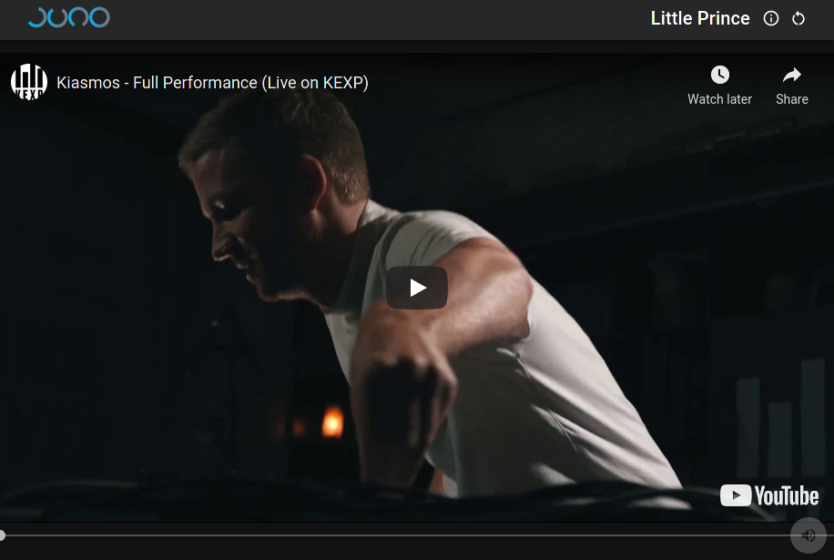

Si vous regardez en haut, vous pouvez voir le nom de l'histoire actuellement jouée, ainsi qu'un bouton "i", et un bouton d'actualisation :

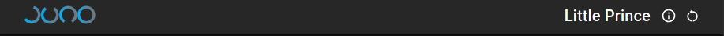

Le bouton "i", lorsqu'il est cliqué, révèle la description de l'histoire. Le bouton d'actualisation, quant à lui, vous permet de recharger l'histoire si jamais vous vous retrouvez dans une impasse.

## Menu latéral

Si vous revenez à l'onglet précédent, la liste des histoires s'affiche. Ce menu vous permet de revenir à la liste des histoires ou, si elle est disponible, à la liste des utilisateurs. Ce menu contiendra également d'autres éléments en mode édition, que nous verrons plus tard.

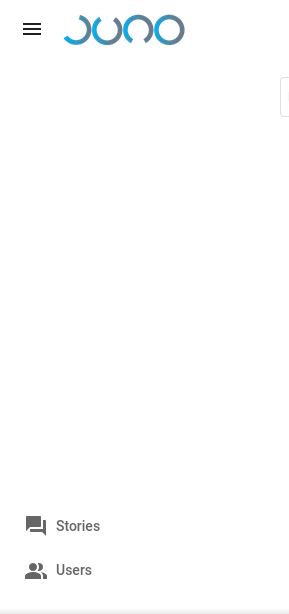

Vous pouvez rendre ce menu plus petit ou plus grand en cliquant sur les trois lignes tout en haut.

## Liste des utilisateurs

En cliquant sur l'option "Utilisateurs" dans le menu latéral mentionné ci-dessus. Cela vous amènera à l'écran suivant :

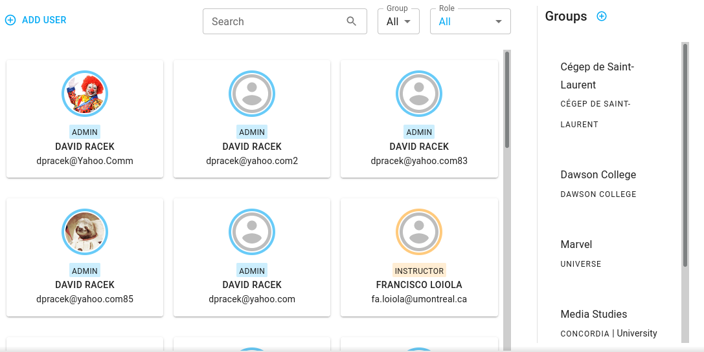

Vous pouvez voir une liste d'utilisateurs, avec une fonction de recherche identique à celle de la liste des histoires.
Sur le côté droit, il y a une liste de tous les groupes existants.

Les utilisateurs se répartissent en trois catégories :

* Étudiants
* Instructeurs
* Administrateurs

Avec un ensemble différent de permissions et d'accès [#TODO].

Si vous avez la permission, vous pouvez ajouter un utilisateur en cliquant sur le menu "ADD USER". Cela ouvrira le dialogue suivant :

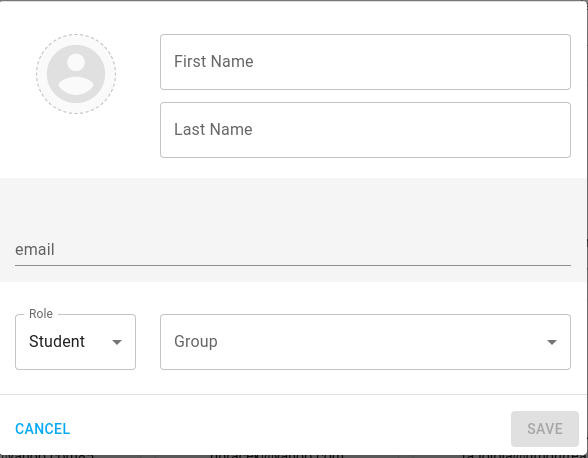

Vous devez spécifier leur :

* Prénom
* Nom de famille
* Adresse électronique
* Rôle

Optionnellement, vous pouvez également spécifier leur :

* Affiliation à un groupe
* Photo de profil

Veuillez noter que l'adresse e-mail et le niveau de permission d'un utilisateur ne peuvent pas être modifiés.

En cliquant sur un utilisateur, un dialogue similaire s'ouvre :

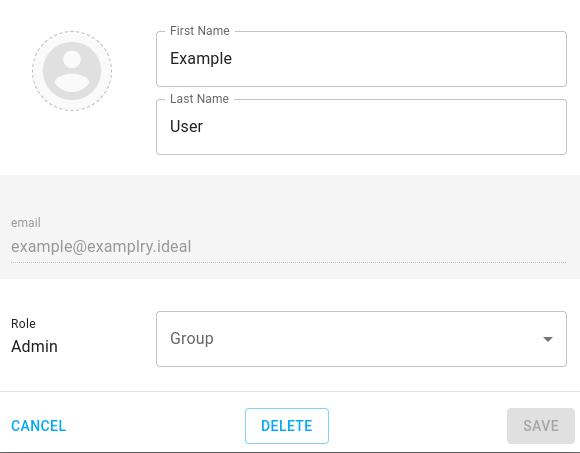.

A partir de laquelle vous pouvez également supprimer un utilisateur, si vous avez la permission de le faire.

## Paramètres

En cliquant sur votre avatar en haut à droite de l'écran principal, vous obtenez le menu suivant :

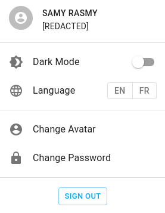.

À partir de celui-ci, vous pouvez activer un thème sombre, changer la langue de l'interface (cela n'affecte pas les histoires elles-mêmes), ainsi que mettre à jour votre photo de profil et votre mot de passe.

Ceci conclut notre introduction à Juno ! Notre [prochain chapitre] (www.junobot.com/tutorials/creation) traite de la création d'histoires.
