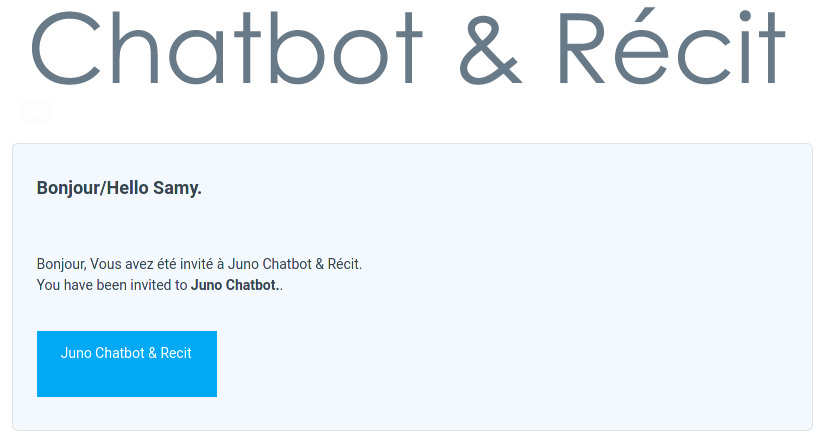
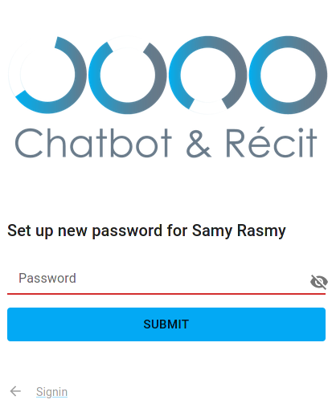

# Welcome

Welcome, and congratulations to being one of the early users of the Juno chatbot platform.

## Signup

The first thing you'll want to do is to complete the signup process. To do this, go to your email inbox and look for an email called `Your JunoChatBot Account / Votre compte Juno ChatBot`.

Click on it, and you'll see something like this:

Click on the blue button. You will then see a page like this:

Write in the password you want to use, then click the "Signin" arrow in the bottom left.

You'll then be able to sign in with the password you just set and the email you received the invitation in. Welcome aboard!
