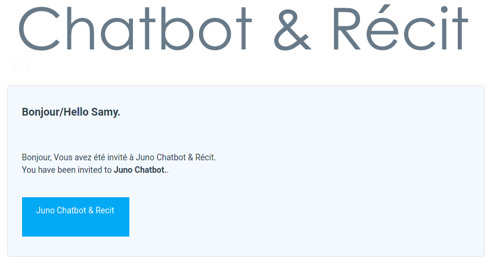
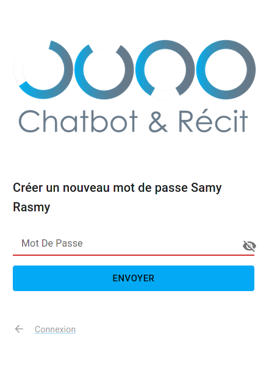

# Bienvenue

Bienvenue, et félicitations pour être l'un des premiers utilisateurs de la plateforme de chatbot Juno.

## Inscription

La première chose à faire est de terminer le processus d'inscription. Pour ce faire, allez dans votre boîte aux lettres électronique et cherchez un email intitulé `Votre compte JunoChatBot / Your Juno ChatBot Account`.

Cliquez dessus, et vous verrez quelque chose comme ceci :

Cliquez sur le bouton bleu. Vous verrez alors une page comme celle-ci :

Saisissez le mot de passe que vous souhaitez utiliser, puis cliquez sur la flèche "Signin" en bas à gauche.

Vous pourrez alors vous connecter avec le mot de passe que vous venez de définir et l'e-mail dans lequel vous avez reçu l'invitation. Bienvenue à bord !
